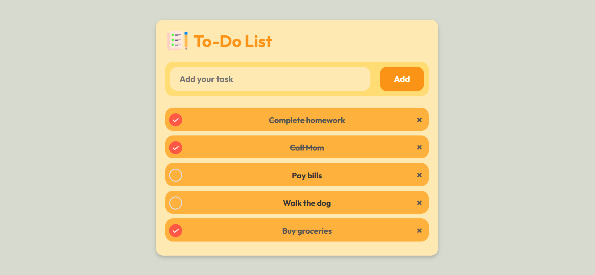
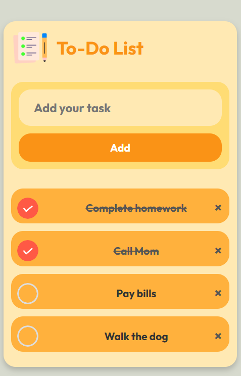

# Daily Do - To-Do List App

**Daily Do** is a simple and intuitive to-do list application designed to help users manage their tasks efficiently. It is fully responsive and offers a clean, eye-pleasing interface for an optimal experience across all device sizes. Built with fundamental web technologies, this project is designed to be easy to understand while offering essential features for task management.

## ⚙️ Demo

You can check out the live version of Daily Do https://iamharshvardhan27.github.io/DailyDo-ToDoList/

## ✨ Key Features

- **Fully Responsive Design**:  
  Daily Do is designed to adapt seamlessly to any device, whether you're on a laptop, tablet, or mobile phone. Here are some screenshots demonstrating its responsiveness:

  - 🖥️ **Laptop View**:  
     
    
  - 📲 **Mobile View**:  
    

- **Eye-Pleasing UI**:  
  The app features a modern and minimalistic design that prioritizes functionality without compromising aesthetics. Its simple layout makes it easy to navigate and use.

- **Simple Technologies**:  
  Daily Do is built using core web technologies, making it easy to understand and modify:
  
  - **HTML5**: For the structure of the application.
  - **CSS3**: For styling and responsiveness.
  - **JavaScript**: For managing task functionality and interactions.

  These technologies ensure the app is easy to learn from, making it a great reference for beginners who want to explore front-end development concepts.

## 🚀 How It Works

1. Add a task by entering it in the input field and pressing "Add Task".
2. View all your tasks in the list below the input field.
3. Mark tasks as completed or delete them when finished.

## 🛠️ Installation

To run the project locally:

1. Download the repo.
2. Open the `index.html` file in your preferred browser.

## 🤝 Contributing

If you'd like to contribute to this project, feel free to fork the repository, create your own branch, and submit a pull request with your enhancements or bug fixes!

